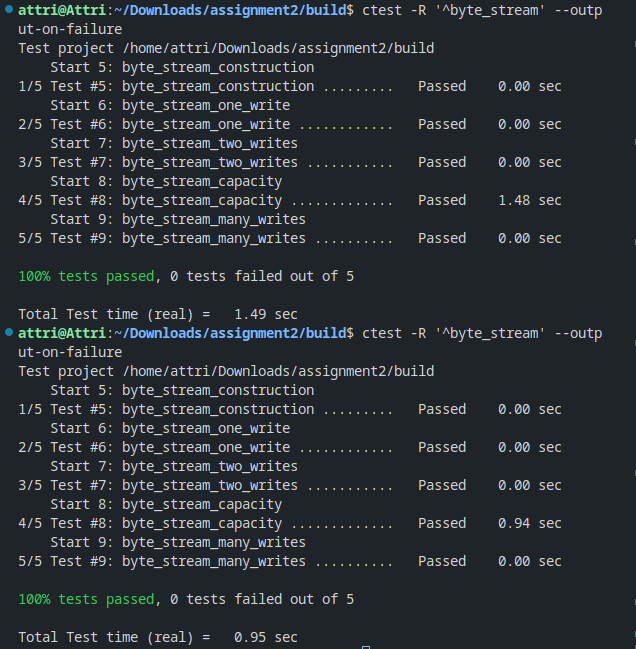

## ByteStream class implementation report

### Introduction

This is the initial part of the assignment where the byte_stream class have been implemented. 

The ByteStream class has been successfully implemented and tested against a set of test cases. It fulfills the requirements outlined in the initial prompt and is ready for use in a single-threaded context.

The code and test results demonstrate the correctness of the implementation, ensuring that bytes can be written, read, and managed in accordance with the specified constraints.

### Implementation

Initialising the constructor for the class
<pre>
ByteStream::ByteStream(const size_t capa)
{

  // Initialising the variables
  maxcapacity = capa; 
  bits_read =0; 
  bits_written =0;
  input_end = false;

}
</pre>

Implementing write method
<pre>
size_t ByteStream::write(const string &data) {
  
  if(input_end) return 0; 

  size_t val=data.size();

  if(data.size()>maxcapacity-bufferarray.size()) val=maxcapacity-bufferarray.size();

  for(int i=0; i< val; i++){
    bufferarray.push_back(data[i]);
  }

  bits_written+=val;

  return val;

}

</pre>

Implementing read method

<pre>

std::string ByteStream::read(const size_t len) {
  
  //sets error
  if(len>bufferarray.size()) set_error();

  if(!_error){
    string read_string;

    read_string=peek_output(len);
    pop_output(len);

    return read_string;
  }

  return "";
}

</pre>

Two helping methods pop output peek output are also implemeted. 

### Screenshot

### More

The code is also pushed to Github in a private repository https://github.com/shubham-attri/ComputerNetworks 
