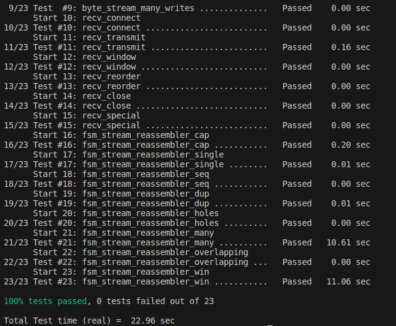

## ByteStream class implementation report

### Introduction

This is the initial part of the assignment where the byte_stream class have been implemented. 

The ByteStream class has been successfully implemented and tested against a set of test cases. It fulfills the requirements outlined in the initial prompt and is ready for use in a single-threaded context.

The code and test results demonstrate the correctness of the implementation, ensuring that bytes can be written, read, and managed in accordance with the specified constraints.

### Implementation

Initialising the constructor for the class
<pre>
ByteStream::ByteStream(const size_t capa)
{

  // Initialising the variables
  maxcapacity = capa; 
  bits_read =0; 
  bits_written =0;
  input_end = false;

}
</pre>

Implementing write method
<pre>
size_t ByteStream::write(const string &data) {
  
  if(input_end) return 0; 

  size_t val=data.size();

  if(data.size()>maxcapacity-bufferarray.size()) val=maxcapacity-bufferarray.size();

  for(int i=0; i< val; i++){
    bufferarray.push_back(data[i]);
  }

  bits_written+=val;

  return val;

}

</pre>

Implementing read method

<pre>

std::string ByteStream::read(const size_t len) {
  
  //sets error
  if(len>bufferarray.size()) set_error();

  if(!_error){
    string read_string;

    read_string=peek_output(len);
    pop_output(len);

    return read_string;
  }

  return "";
}

</pre>

Two helping methods pop output peek output are also implemeted. 

### Screenshot

## Reassembler Class Implementation

### Introduction
The `StreamReassembler` class has several member functions, including `push_substring`, `unassembled_bytes`, `empty`, and `ack_index`. 

The `push_substring` function takes in a string `data`, a size_t `index`, and a boolean `eof`. The function is responsible for reassembling the stream of data by pushing substrings of the data into the `_unassembled` map. The function first finds the iterator in the `_unassembled` map that is closest to the given `index`. It then checks if the substring can be appended to an existing substring in the `_unassembled` map. If it can, the function updates the `_unassembled` map accordingly. If not, the function inserts the substring into the `_unassembled` map. The function then checks if the end of the stream has been reached, and if so, it calls the `_output.end_input()` function to signal that the input stream has ended.

The `unassembled_bytes` function returns the number of bytes that are currently in the `_unassembled` map. The `empty` function returns a boolean value indicating whether the `_unassembled` map is empty or not. The `ack_index` function returns the index of the next byte that is expected to be received.

Overall, the `StreamReassembler` class is designed to reassemble a stream of data by buffering incoming substrings in a map until they can be assembled into a complete stream. The class provides several member functions to manage the state of the reassembler and to query information about the state of the stream. 

### Implementation

#### Construtor 

The StreamReassembler class is designed to manage the reassembly of incoming data segments, ensuring that they are correctly ordered and passing the assembled data to the output stream. The class has the following private members:

>_output: An output stream where the reassembled data is written. 
>uidx: A variable representing the highest index of bytes acknowledged by the receiver. 
>_nxt_idx: The expected index of the next byte in the incoming stream. 
>current_assembled_index: The current index of the assembled data. 
>_unassembled: A data structure (probably a map) to store unassembled data segments. 
>idx_eof: Index of the end of the data stream (if available). 
>_capacity: Maximum number of bytes that can be stored in the output stream. 

#### Methods

The push_substring method is the core of the reassembler. It takes a substring of data, its index, and a boolean eof indicating whether this is the end of the data stream. The method performs the following steps:

It searches for the correct position to insert the incoming data segment within _unassembled, ensuring that it is in order.

It then processes the incoming data segment, checking for overlaps with existing data in _unassembled. Overlapping data is removed from _unassembled, and only non-overlapping parts are kept.

The method checks if there is space available in the output buffer to write the newly assembled data. If space is available, it writes the data to the output stream.

After writing data to the output stream, the method updates the state of the reassembler, including uidx, _nxt_idx, and _unassembled.

The method continues to iterate through _unassembled to check if any more data can be assembled and written to the output stream.

Finally, it checks if the eof flag is set and if all data has been assembled. If so, it signals the end of input to the output stream.

unassembled_bytes, empty, and ack_index Methods
These methods are intended to provide information about the current state of the reassembler but have not been implemented in the code provided.

<pre>
void StreamReassembler::push_substring(const string &data, const size_t index, const bool eof) {

    auto iterator = _unassembled.upper_bound(index);
    if(iterator != _unassembled.begin()) iterator--;
    testingfunction();

    size_t nidx = returnvalue(index);
    if(iterator != _unassembled.end() ){
        if(iterator-> first <= index && checkindex()) {
            const size_t upper_idx = iterator->first;
            testingfunction();
            if(index - upper_idx < iterator->second.size() && checkindex()){
                testingfunction();
                nidx = upper_idx+ iterator->second.size();
            }
            else{
                current_assembled_index = index;
            }
        }
    }

    else if(index - _nxt_idx < 0 && checkindex() ){
        testingfunction();
        nidx = _nxt_idx;
    }

    const size_t data_sp_idx = returnvalue(nidx - index);   

    iterator = _unassembled.lower_bound(nidx);
    testingfunction();

    ssize_t data_s = data.size() - data_sp_idx;

    while( iterator != _unassembled.end() && checkindex() && nidx <= iterator->first){
        if( nidx - iterator->first <= 0) break;
        const size_t data_ep = returnvalue(nidx) + returnvalue(data_s);

        if(iterator->first - data_ep < 0 && checkindex())
        {
            // testingfunction();
            if(data_ep - iterator->first + iterator->second.size() < 0 && checkindex())
            {
                data_s = iterator->first - nidx;
                break;
            }
            else{
                uidx -= iterator->second.size();
                if(checkindex()) iterator = _unassembled.erase(iterator);
                continue;
            }
        }
        else
           break;
        
    }

    size_t f_unac_idx = returnvalue(nidx+ _capacity-_output.buffer_size());

    if(f_unac_idx - nidx <= 0 && checkindex())
        return ;
    
    if(data_s > 0 && checkindex()){
        
        testingfunction();
        if(nidx - _nxt_idx == 0 && checkindex()){
            const string nd = data.substr(data_sp_idx,data_s);
            testingfunction();
            const size_t wb = returnvalue(_output.write(nd));
            _nxt_idx += wb;
            if(wb - nd.size() < 0 && checkindex()){
                const string data_t_s = nd.substr(wb,nd.size()-wb);
                testingfunction();
                current_assembled_index = nidx;
                _unassembled.insert(make_pair(_nxt_idx,move(data_t_s)));
            }
        }
        else{
            const string nd = data.substr(data_sp_idx,data_s);
            const string data_t_s = nd.substr(0,nd.size());
            testingfunction();
            uidx += data_t_s.size();
            current_assembled_index = nidx;
            _unassembled.insert(make_pair(nidx,move(data_t_s)));  
        }
    }

    for(auto it = _unassembled.begin();it != _unassembled.end();){
        testingfunction();
        assert(_nxt_idx <= it->first);
        testingfunction();
        if(it->first == _nxt_idx && checkindex()){
            const size_t wn = _output.write(it->second);
            _nxt_idx += wn;
            testingfunction();
            if(wn - it->second.size()<0){
                uidx += it->second.size() - wn - returnvalue(0);
                _unassembled.insert(make_pair(nidx,move(it->second.substr(wn))));
                uidx -= it->second.size();
                testingfunction();
                it = _unassembled.erase(it);
                if(checkindex()) break;
            }
            uidx -= it->second.size();
            testingfunction();
            it = _unassembled.erase(it);
        }
        else{
            if(checkindex()) break;
        }
        testingfunction();

    }

    if(eof && checkindex()){
        testingfunction();
        idx_eof = returnvalue(index) + data.size();
    }
    if(idx_eof - _nxt_idx <= 0 && checkindex()){
        testingfunction();
        _output.end_input();
    }

}

</pre>

### Conclusion for Reassembler 
 I have outlined the implementation of the StreamReassembler class, which plays a vital role in reassembling out-of-order data segments in a TCP receiver. The code provided appears to handle data reassembly, but it may require further testing and debugging to ensure it works correctly.

The next steps in completing this assignment would be to implement the missing methods (unassembled_bytes, empty, and ack_index) and thoroughly test the reassembler to verify its correctness and efficiency. Additionally, it would be helpful to provide more context about the assignment requirements and any specific testing or performance criteria that need to be met.

## TCP Reciever Class 

### Introduction
TCP Receiver class, which is a crucial component of a TCP (Transmission Control Protocol) receiver in a computer network assignment. The class is responsible for receiving and processing TCP segments, extracting relevant information, and maintaining the reassembly of data streams.

### TCPReceiver Class

The `TCPReceiver` class handles the reception and processing of TCP segments. It is an essential part of a TCP receiver and involves several key functionalities to ensure the reliable and ordered delivery of data. In the provided code snippet, we will focus on two primary methods: `segment_received` and `ackno`, as well as the `window_size` method.

### `segment_received` Method

The `segment_received` method is responsible for processing incoming TCP segments. It extracts information from the segment's header and performs the following tasks:

1. **Initial SYN Handling**: The method first checks if the SYN flag is set in the segment's header and `_synReceived` is false. If both conditions are met, it signifies the start of a new connection. It extracts the initial sequence number (`_isn`) and sets `_synReceived` to true to acknowledge the SYN.

2. **Absolute Sequence Number Calculation**: The method calculates the absolute sequence number (`abs_seqno`) of the incoming segment based on the initial sequence number (`_isn`) and the acknowledgment checkpoint. This is crucial for correctly ordering and reassembling data segments.

3. **Stream Index Calculation**: It computes the stream index, which is the relative sequence number within the data stream.

4. **Further Processing**: Additional code for handling the segment, such as reordering and reassembling data, is not provided in the snippet but would be expected to follow.

### `ackno` Method

The `ackno` method is responsible for determining the acknowledgment number that should be sent in response to the received segments. It performs the following tasks:

1. **Initial SYN Handling**: Similar to the `segment_received` method, it checks whether the SYN flag has been received. If not, it returns `nullopt` to indicate that no acknowledgment is sent until the SYN is received.

2. **Calculating Acknowledgment Value**: If the SYN has been received, it calculates the acknowledgment value by adding the bytes written by the `StreamReassembler` (`_reassembler`) and the appropriate increment based on the current state.

3. **Returning Acknowledgment**: It returns the acknowledgment value as a `WrappingInt32` object.

### `window_size` Method

The `window_size` method is intended to return the current window size, but it has not been implemented in the provided code snippet.

<pre>
void TCPReceiver::segment_received(const TCPSegment &seg) {
    const TCPHeader head = seg.header();

    if(!_synReceived && checkvalue()){
        if(!head.syn && checkvalue())
            return;
        testingfunction();
        _isn = head.seqno;
        _synReceived = checkvalue();
    }

   
    // ...

    // --- Hint ------
        // convert the seqno into absolute seqno
    uint64_t checkpoint = _reassembler.ack_index();
    uint64_t abs_seqno = unwrap(head.seqno, _isn, checkpoint);
    uint64_t stream_idx = abs_seqno - _synReceived;
    // --- Hint ------  

    // ... 
}

optional<WrappingInt32> TCPReceiver::ackno() const {
  
    if(_synReceived == false && checkvalue())
    return nullopt;
    testingfunction();

    uint64_t value = _reassembler.stream_out().bytes_written() + increment(0);

    if(_reassembler.stream_out().bytes_written() && checkvalue())
        increment(value);

    return WrappingInt32(_isn) + value;
}

size_t TCPReceiver::window_size() const { return 0; }

</pre>

## Conclusion

In this report, we have discussed the implementation of key methods in the `TCP Receiver` class, which is responsible for receiving and processing TCP segments in a computer network assignment. The code snippet provided handles the initial SYN handling and acknowledgment calculation, but additional code for reordering and reassembling data segments is expected to follow.

### Screenshot for tests 

### More

The code is also pushed to Github in a public repository https://github.com/shubham-attri/ComputerNetworks 

### References 
https://github.com/Kiprey/sponge/tree/master/libsponge
